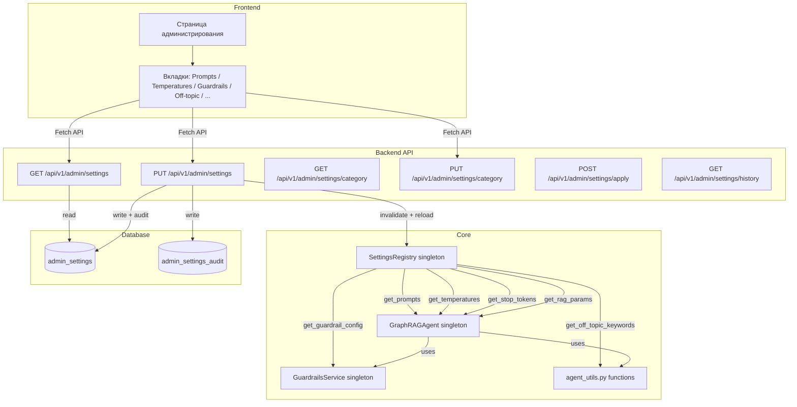
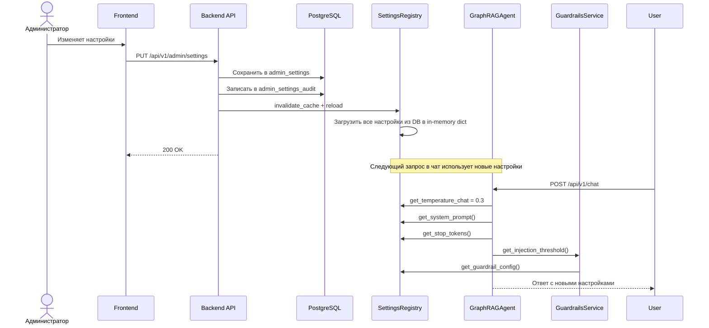
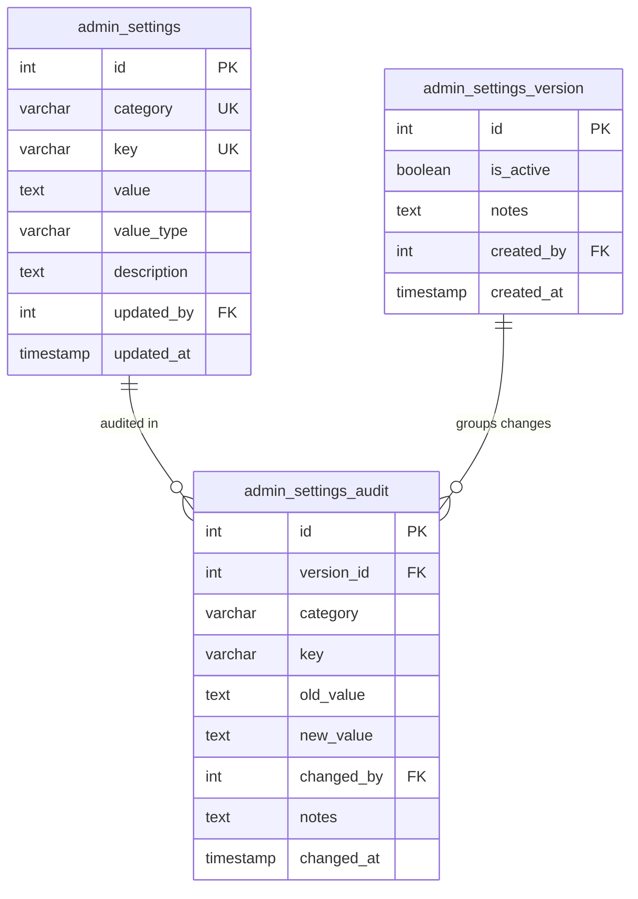
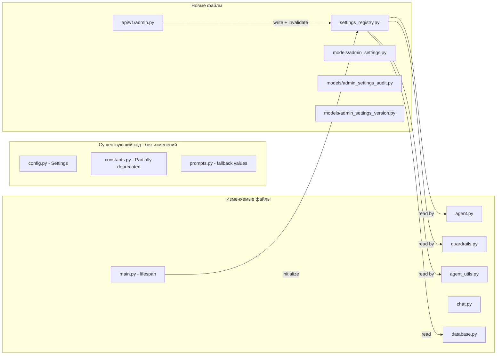

# Архитектура раздела "Администрирование" для GraphRAG

## Содержание

1. [Общая схема](#1-общая-схема)
2. [Модель данных PostgreSQL](#2-модель-данных-postgresql)
3. [Backend API](#3-backend-api)
4. [Integration Layer — SettingsRegistry](#4-integration-layer--settingsregistry)
5. [Интеграция с существующими сервисами](#5-интеграция-с-существующими-сервисами)
6. [Frontend](#6-frontend)
7. [Миграция Alembic](#7-миграция-alembic)
8. [План реализации Todo-list](#8-план-реализации)

---

## 1. Общая схема



### Поток применения настроек



---

## 2. Модель данных PostgreSQL

### 2.1 Таблица `admin_settings`

Хранит текущие активные значения настроек. Плоская key-value структура с категориями для точечного обновления.

```sql
CREATE TABLE admin_settings (
    id              SERIAL PRIMARY KEY,
    category        VARCHAR(64) NOT NULL,
    key             VARCHAR(128) NOT NULL,
    value           TEXT NOT NULL DEFAULT '',
    value_type      VARCHAR(32) NOT NULL DEFAULT 'string',
    description     TEXT,
    updated_by      INTEGER REFERENCES "user"(id),
    updated_at      TIMESTAMP WITH TIME ZONE DEFAULT NOW(),
    
    UNIQUE(category, key)
);

CREATE INDEX ix_admin_settings_category ON admin_settings(category);
CREATE INDEX ix_admin_settings_key ON admin_settings(key);
```

**Категории и ключи:**

| Категория (`category`) | Ключ (`key`) | Тип (`value_type`) | Описание |
|---|---|---|---|
| `prompts` | `system_prompt` | `text` | Системный промпт для RAG-агента |
| `prompts` | `spelling_correction_prompt` | `text` | Промпт коррекции опечаток |
| `prompts` | `entity_extraction_prompt` | `text` | NER промпт |
| `prompts` | `no_context_message` | `text` | Сообщение при отсутствии контекста |
| `prompts` | `context_header` | `text` | Заголовок секции контекста |
| `prompts` | `ner_system_prompt` | `text` | Системный промпт для NER |
| `llm_temperature` | `temperature_chat` | `float` | Температура генерации ответа |
| `llm_temperature` | `temperature_spelling` | `float` | Температура коррекции опечаток |
| `llm_temperature` | `temperature_ner` | `float` | Температура NER |
| `guardrails` | `enabled` | `boolean` | Включение/отключение guardrails |
| `guardrails` | `max_input_length` | `integer` | Максимальная длина ввода |
| `guardrails` | `injection_threshold` | `float` | Порог срабатывания injection |
| `guardrails` | `pii_masking_enabled` | `boolean` | Включение PII-маскировки |
| `guardrails` | `injection_patterns` | `json_array` | Массив regex паттернов инъекций |
| `guardrails` | `pii_patterns` | `json_object` | Объект PII-паттернов |
| `off_topic` | `business_domain_keywords` | `json_array` | Массив ключевых слов бизнес-домена |
| `stop_tokens` | `tokens` | `json_array` | Массив стоп-токенов |
| `rag_parameters` | `reranker_min_results` | `integer` | Мин. количество результатов |
| `rag_parameters` | `reranker_max_results` | `integer` | Макс. количество результатов |
| `rag_parameters` | `reranker_scale_factor` | `float` | Масштабирующий коэффициент |
| `rag_parameters` | `reranker_top_k` | `integer` | Fallback top-k |
| `other` | `max_tokens` | `integer` | MAX_TOKENS |
| `other` | `ollama_num_ctx` | `integer` | OLLAMA_NUM_CTX |
| `other` | `graph_query_keywords` | `json_array` | Ключевые слова графовых запросов |

### 2.2 Таблица `admin_settings_audit`

Хранит историю изменений с версионированием.

```sql
CREATE TABLE admin_settings_audit (
    id              SERIAL PRIMARY KEY,
    version_id      INTEGER NOT NULL,
    category        VARCHAR(64) NOT NULL,
    key             VARCHAR(128) NOT NULL,
    old_value       TEXT,
    new_value       TEXT,
    changed_by      INTEGER REFERENCES "user"(id),
    notes           TEXT,
    changed_at      TIMESTAMP WITH TIME ZONE DEFAULT NOW()
);

CREATE INDEX ix_admin_settings_audit_version ON admin_settings_audit(version_id);
CREATE INDEX ix_admin_settings_audit_category ON admin_settings_audit(category);
CREATE INDEX ix_admin_settings_audit_changed_at ON admin_settings_audit(changed_at DESC);
```

### 2.3 Таблица `admin_settings_version`

Группирует изменения по версиям для отката и аудита.

```sql
CREATE TABLE admin_settings_version (
    id              SERIAL PRIMARY KEY,
    is_active       BOOLEAN NOT NULL DEFAULT FALSE,
    notes           TEXT,
    created_by      INTEGER REFERENCES "user"(id),
    created_at      TIMESTAMP WITH TIME ZONE DEFAULT NOW()
);

CREATE INDEX ix_admin_settings_version_active ON admin_settings_version(is_active) WHERE is_active = TRUE;
```

**Схема связей:**



---

## 3. Backend API

### 3.1 Эндпоинты

Все эндпоинты находятся за префиксом `/api/v1/admin` и защищены RBAC (только роль `admin`).

#### `GET /api/v1/admin/settings`

Получение всех настроек, сгруппированных по категориям.

**Response 200:**
```json
{
  "success": true,
  "settings": {
    "prompts": {
      "system_prompt": { "value": "...", "value_type": "text" },
      "spelling_correction_prompt": { "value": "...", "value_type": "text" },
      "entity_extraction_prompt": { "value": "...", "value_type": "text" },
      "no_context_message": { "value": "...", "value_type": "text" }
    },
    "llm_temperature": {
      "temperature_chat": { "value": "0.1", "value_type": "float" },
      "temperature_spelling": { "value": "0.0", "value_type": "float" },
      "temperature_ner": { "value": "0.0", "value_type": "float" }
    },
    "guardrails": {
      "enabled": { "value": "true", "value_type": "boolean" },
      "max_input_length": { "value": "10000", "value_type": "integer" },
      "injection_threshold": { "value": "0.85", "value_type": "float" }
    },
    "off_topic": {
      "business_domain_keywords": { "value": "[\"закон\",\"статья\",...]", "value_type": "json_array" }
    },
    "stop_tokens": {
      "tokens": { "value": "[\"中文\",\"Chinese:\",\"English:\"]", "value_type": "json_array" }
    },
    "rag_parameters": {
      "reranker_min_results": { "value": "10", "value_type": "integer" },
      "reranker_max_results": { "value": "50", "value_type": "integer" },
      "reranker_scale_factor": { "value": "8.0", "value_type": "float" }
    },
    "other": {
      "max_tokens": { "value": "2048", "value_type": "integer" },
      "ollama_num_ctx": { "value": "4096", "value_type": "integer" }
    }
  },
  "updated_at": "2026-07-07T12:00:00Z"
}
```

#### `PUT /api/v1/admin/settings`

Обновление всех/нескольких настроек. Принимает словарь категорий с ключами.

**Request:**
```json
{
  "settings": {
    "llm_temperature": {
      "temperature_chat": "0.3"
    },
    "guardrails": {
      "injection_threshold": "0.75"
    }
  }
}
```

**Response 200:**
```json
{
  "success": true,
  "applied": true,
  "version_id": 5,
  "changed_keys": 2,
  "updated_at": "2026-07-07T12:05:00Z"
}
```

**Алгоритм:**
1. Получить текущие значения из БД
2. Сравнить с новыми значениями
3. Создать новую версию в `admin_settings_version`
4. Обновить изменённые записи в `admin_settings`
5. Записать изменения в `admin_settings_audit`
6. Инвалидировать кэш `SettingsRegistry`
7. Перезагрузить настройки в `SettingsRegistry`

#### `GET /api/v1/admin/settings/{category}`

Получение настроек конкретной категории.

**Response 200:**
```json
{
  "success": true,
  "category": "guardrails",
  "settings": {
    "enabled": { "value": "true", "value_type": "boolean" },
    "injection_threshold": { "value": "0.85", "value_type": "float" }
  }
}
```

#### `PUT /api/v1/admin/settings/{category}`

Обновление настроек одной категории.

**Request:**
```json
{
  "settings": {
    "injection_threshold": "0.70",
    "enabled": "false"
  }
}
```

#### `POST /api/v1/admin/settings/apply`

Принудительное применение текущих настроек (re-read из БД в кэш).

**Response 200:**
```json
{
  "success": true,
  "applied": true
}
```

Используется если администратор хочет гарантированно применить настройки после ручных правок в БД.

#### `GET /api/v1/admin/settings/history`

История изменений настроек с пагинацией.

**Query params:** `page=1&page_size=20`

**Response 200:**
```json
{
  "success": true,
  "history": [
    {
      "version_id": 5,
      "changed_at": "2026-07-07T12:05:00Z",
      "changed_by": "admin@graphrag.local",
      "notes": "Изменение температуры и порога injection",
      "changes": [
        {
          "category": "llm_temperature",
          "key": "temperature_chat",
          "old_value": "0.1",
          "new_value": "0.3"
        }
      ]
    }
  ],
  "total": 5,
  "page": 1,
  "page_size": 20
}
```

### 3.2 Структура файлов

```
backend/app/
  api/v1/
    admin.py                          # Новый роутер с эндпоинтами администрирования
    api.py                            # + include_router(admin_router, prefix="/admin")
  core/
    settings_registry.py              # НОВЫЙ: SettingsRegistry синглтон
  models/
    admin_settings.py                 # НОВЫЙ: SQLModel для admin_settings
    admin_settings_audit.py           # НОВЫЙ: SQLModel для admin_settings_audit
    admin_settings_version.py         # НОВЫЙ: SQLModel для admin_settings_version
    schemas.py                        # + Pydantic схемы для API администрирования
    __init__.py                       # + импорт новых моделей
```

---

## 4. Integration Layer — SettingsRegistry

### 4.1 Класс `SettingsRegistry`

Синглтон, который держит in-memory кэш настроек и предоставляет typed-getter-ы.

```python
# backend/app/core/settings_registry.py

import json
from typing import Any, Optional
from app.core.logging import logger


class SettingsRegistry:
    """
    In-memory registry for admin settings.
    
    Populated on startup from PostgreSQL admin_settings table.
    Invalidated and reloaded on PUT /api/v1/admin/settings.
    All runtime components read from this registry instead of hardcoded constants.
    """
    
    def __init__(self):
        self._cache: dict[str, dict[str, Any]] = {}
        self._loaded = False
    
    async def initialize(self):
        """Load all settings from DB into memory."""
        from app.services.database import database_service
        self._cache = await database_service.load_all_admin_settings()
        self._loaded = True
        logger.info("settings_registry_initialized", categories=list(self._cache.keys()))
    
    async def reload(self):
        """Reload all settings from DB (called after admin update)."""
        from app.services.database import database_service
        self._cache = await database_service.load_all_admin_settings()
        logger.info("settings_registry_reloaded")
    
    def _get(self, category: str, key: str, default: Any = None) -> Any:
        return self._cache.get(category, {}).get(key, {}).get("value", default)
    
    def _get_typed(self, category: str, key: str, value_type: str, default: Any = None) -> Any:
        raw = self._get(category, key)
        if raw is None:
            return default
        try:
            if value_type == "string":
                return raw
            elif value_type == "boolean":
                return raw.lower() in ("true", "1", "yes")
            elif value_type == "integer":
                return int(raw)
            elif value_type == "float":
                return float(raw)
            elif value_type in ("json_array", "json_object"):
                return json.loads(raw)
            return raw
        except (ValueError, json.JSONDecodeError):
            logger.warning("settings_parse_error", category=category, key=key, raw=raw)
            return default
    
    def get_prompts(self) -> dict:
        return self._cache.get("prompts", {})
    
    def get_system_prompt(self) -> str:
        return self._get("prompts", "system_prompt", "")
    
    def get_spelling_correction_prompt(self) -> str:
        return self._get("prompts", "spelling_correction_prompt", "")
    
    def get_entity_extraction_prompt(self) -> str:
        return self._get("prompts", "entity_extraction_prompt", "")
    
    def get_no_context_message(self) -> str:
        return self._get("prompts", "no_context_message", "")
    
    def get_context_header(self) -> str:
        return self._get("prompts", "context_header", "")
    
    def get_temperature_chat(self) -> float:
        return self._get_typed("llm_temperature", "temperature_chat", "float", 0.1)
    
    def get_temperature_spelling(self) -> float:
        return self._get_typed("llm_temperature", "temperature_spelling", "float", 0.0)
    
    def get_temperature_ner(self) -> float:
        return self._get_typed("llm_temperature", "temperature_ner", "float", 0.0)
    
    def get_guardrail_config(self) -> dict:
        return {
            "enabled": self._get_typed("guardrails", "enabled", "boolean", True),
            "max_input_length": self._get_typed("guardrails", "max_input_length", "integer", 10000),
            "injection_threshold": self._get_typed("guardrails", "injection_threshold", "float", 0.85),
            "pii_masking_enabled": self._get_typed("guardrails", "pii_masking_enabled", "boolean", True),
        }
    
    def get_injection_patterns(self) -> list:
        return self._get_typed("guardrails", "injection_patterns", "json_array", [])
    
    def get_pii_patterns(self) -> dict:
        return self._get_typed("guardrails", "pii_patterns", "json_object", {})
    
    def get_off_topic_keywords(self) -> list[str]:
        return self._get_typed("off_topic", "business_domain_keywords", "json_array", [])
    
    def get_stop_tokens(self) -> list[str]:
        return self._get_typed("stop_tokens", "tokens", "json_array", [])
    
    def get_rag_parameters(self) -> dict:
        return {
            "reranker_min_results": self._get_typed("rag_parameters", "reranker_min_results", "integer", 10),
            "reranker_max_results": self._get_typed("rag_parameters", "reranker_max_results", "integer", 50),
            "reranker_scale_factor": self._get_typed("rag_parameters", "reranker_scale_factor", "float", 8.0),
            "reranker_top_k": self._get_typed("rag_parameters", "reranker_top_k", "integer", 10),
        }
    
    def get_graph_query_keywords(self) -> list[str]:
        return self._get_typed("other", "graph_query_keywords", "json_array", [])
    
    def get_max_tokens(self) -> int:
        return self._get_typed("other", "max_tokens", "integer", 2048)
    
    def get_ollama_num_ctx(self) -> int:
        return self._get_typed("other", "ollama_num_ctx", "integer", 4096)


# Singleton
settings_registry = SettingsRegistry()
```

### 4.2 `DatabaseService.load_all_admin_settings`

Добавить метод в существующий [`database_service`](backend/app/services/database.py):

```python
async def load_all_admin_settings(self) -> dict[str, dict[str, dict]]:
    """Load all admin settings grouped by category."""
    from app.models.admin_settings import AdminSetting
    
    with Session(self.engine) as s:
        rows = s.exec(select(AdminSetting)).all()
        result: dict = {}
        for row in rows:
            cat = result.setdefault(row.category, {})
            cat[row.key] = {
                "value": row.value,
                "value_type": row.value_type,
            }
        return result
```

---

## 5. Интеграция с существующими сервисами

### 5.1 Карта изменений



### 5.2 Изменения в [`constants.py`](backend/app/core/constants.py)

Значения становятся fallback-дефолтами на случай, если БД пуста или Registry не загружен. Сами константы остаются для обратной совместимости, но все runtime-компоненты должны читать из `SettingsRegistry`.

### 5.3 Изменения в [`agent.py`](backend/app/core/langgraph/agent.py)

**Узел `_generate_response`** (строки 355-456):

```python
# Вместо импорта из constants:
# from app.core.constants import LLM_TEMPERATURE_CHAT, STOP_TOKENS

# Читаем из registry:
from app.core.settings_registry import settings_registry

async def _generate_response(self, state: dict) -> dict:
    # ... existing code ...
    
    # Заменяем LLM_TEMPERATURE_CHAT на динамическую
    temperature = settings_registry.get_temperature_chat()
    stop_tokens = settings_registry.get_stop_tokens()
    
    # Используем в вызове ollama:
    response = await ollama_service.chat(
        messages=chat_messages,
        temperature=temperature,
        options={
            "num_predict": max(settings_registry.get_max_tokens(), 4096),
            "stop": stop_tokens,
        },
    )
```

**Метод `get_streaming_response`** (строка 562-569) — та же замена.

### 5.4 Изменения в [`guardrails.py`](backend/app/core/security/guardrails.py)

```python
from app.core.settings_registry import settings_registry

class GuardrailsService:
    def __init__(self):
        # Компилируем при создании, но паттерны будут перекомпилированы при reload
        self._init_patterns()
    
    def _init_patterns(self):
        """Initialize or reinitialize patterns from registry."""
        config = settings_registry.get_guardrail_config()
        injection_patterns = settings_registry.get_injection_patterns()
        pii_patterns = settings_registry.get_pii_patterns()
        
        self._pii_patterns = {
            name: (re.compile(strict), re.compile(loose), label)
            for name, (strict, loose, label) in (pii_patterns or PII_PATTERNS).items()
        }
        self._injection_patterns = [
            re.compile(p) for p in (injection_patterns or INJECTION_PATTERNS)
        ]
    
    def reload_patterns(self):
        """Reload patterns from registry without recreating the service."""
        self._init_patterns()
        logger.info("guardrails_patterns_reloaded")
    
    def check_input(self, text: str) -> GuardrailResult:
        config = settings_registry.get_guardrail_config()
        
        if not config["enabled"]:
            return GuardrailResult(is_safe=True, sanitized_text=text)
        
        # Используем динамический threshold
        if len(text) > config["max_input_length"]:
            # ... existing logic ...
        
        injection_score = self._detect_injection(text)
        if injection_score >= config["injection_threshold"]:
            # ... existing logic ...
        
        # PII маскировка только если включена
        if config["pii_masking_enabled"]:
            sanitized, pii_found = self._mask_pii(text)
        else:
            sanitized, pii_found = text, []
        
        # ...
    
    def filter_output(self, text: str) -> str:
        config = settings_registry.get_guardrail_config()
        if not config["enabled"] or not config["pii_masking_enabled"]:
            return text
        sanitized, _ = self._mask_pii(text)
        return sanitized
```

### 5.5 Изменения в [`agent_utils.py`](backend/app/core/langgraph/agent_utils.py)

```python
from app.core.settings_registry import settings_registry

def build_system_prompt(context: str, graph_context_stats: dict = None) -> str:
    # Используем динамические промпты из registry
    system_prompt = settings_registry.get_system_prompt()
    no_context_message = settings_registry.get_no_context_message()
    context_header = settings_registry.get_context_header()
    
    # ... remaining logic uses these instead of imported constants ...

def is_off_topic(query: str) -> bool:
    # Используем динамические ключевые слова
    business_keywords = settings_registry.get_off_topic_keywords()
    # Fallback на хардкод, если registry пуст
    if not business_keywords:
        from app.core.langgraph.agent_utils import BUSINESS_DOMAIN_KEYWORDS
        business_keywords = BUSINESS_DOMAIN_KEYWORDS
    
    if not query or not query.strip():
        return True
    query_lower = query.lower()
    for kw in business_keywords:
        if kw.lower() in query_lower:
            return False
    return True

async def correct_spelling(text: str, ollama_service) -> str:
    # Используем динамическую температуру и промпт
    temperature = settings_registry.get_temperature_spelling()
    spelling_prompt = settings_registry.get_spelling_correction_prompt()
    
    # ... existing logic with dynamic values ...
```

### 5.6 Изменения в [`chat.py`](backend/app/api/v1/chat.py)

```python
# Вместо хардкодного threshold в `check_input`
# guardrails_service.check_input теперь сам читает динамический threshold из registry
# Изменений не требуется, если guardrails_service.reads из registry
```

### 5.7 Изменения в [`main.py`](backend/app/main.py) — lifespan

Добавить инициализацию `SettingsRegistry` в startup:

```python
from app.core.settings_registry import settings_registry

async def lifespan(app: FastAPI):
    # ... existing init ...
    
    # Initialize settings registry
    try:
        await settings_registry.initialize()
        logger.info("settings_registry_initialized")
    except Exception as e:
        logger.warning("settings_registry_init_failed", error=str(e))
        # Continue with fallback values from constants.py
    
    # ... rest of startup ...
```

---

## 6. Frontend

### 6.1 Структура страницы

Страница администрирования — SPA-секция с вкладками:

```
┌─────────────────────────────────────────────────────────┐
│  ⚙️ Администрирование GraphRAG                           │
├─────────┬─────────┬───────────┬──────────┬──────────────┤
│ Prompts │  LLM    │ Guardrails│ Off-topic│  ...         │
│         │ Temp.   │           │ Keywords │              │
├─────────┴─────────┴───────────┴──────────┴──────────────┤
│                                                         │
│  ┌─── Активная вкладка: Prompts ────────────────────┐   │
│  │                                                    │   │
│  │  📝 Системный промпт                               │   │
│  │  ┌─────────────────────────────────────────────┐   │   │
│  │  │ Ты — ассистент для поиска ТОЛЬКО по         │   │   │
│  │  │ загруженным документам...                    │   │   │
│  │  │                                              │   │   │
│  │  └─────────────────────────────────────────────┘   │   │
│  │                                                    │   │
│  │  📝 Промпт коррекции опечаток                      │   │
│  │  ┌─────────────────────────────────────────────┐   │   │
│  │  │ Ты — корректор орфографии...                 │   │   │
│  │  └─────────────────────────────────────────────┘   │   │
│  │                                                    │   │
│  │  📝 NER промпт                                     │   │
│  │  ┌─────────────────────────────────────────────┐   │   │
│  │  │ Ты — система извлечения сущностей...         │   │   │
│  │  └─────────────────────────────────────────────┘   │   │
│  │                                                    │   │
│  │  [ 💾 Сохранить ]                                  │   │
│  └────────────────────────────────────────────────────┘   │
│                                                         │
│  ┌─── История изменений ─────────────────────────────┐   │
│  │  #5 | 12:05 | admin@graphrag.local | Изменение    │   │
│  │  #4 | 11:30 | admin@graphrag.local | Обновление   │   │
│  │  #3 | 10:15 | admin@graphrag.local | Начальная    │   │
│  └────────────────────────────────────────────────────┘   │
└─────────────────────────────────────────────────────────┘
```

### 6.2 Вкладки

| Вкладка | Компоненты | Типы полей |
|---|---|---|
| **Prompts** | System prompt, Spelling prompt, NER prompt, No context message, Context header, NER system prompt | textarea (full width, monospace) |
| **LLM Temperature** | Chat temperature, Spelling temperature, NER temperature | number input (0.0–1.0, step 0.05) |
| **Guardrails** | Enabled toggle, Max input length, Injection threshold, PII masking toggle, Injection patterns editor, PII patterns editor | switch, number, slider, JSON textarea |
| **Off-topic Keywords** | Business domain keywords list | textarea (one keyword per line) |
| **Stop Tokens** | Tokens list | textarea (one token per line) |
| **RAG Parameters** | Min results, Max results, Scale factor, Top-K | number inputs |
| **Other** | MAX_TOKENS, OLLAMA_NUM_CTX, Graph query keywords | number inputs, textarea for keywords |

### 6.3 API-методы для Frontend

Добавить в [`frontend/js/api.js`](frontend/js/api.js) класс `GraphRAGApi`:

```javascript
// Admin Settings
async getAdminSettings() {
    const r = await fetch(`${API_BASE}/admin/settings`, { headers: this.headers });
    if (!r.ok) throw new Error('Ошибка загрузки настроек');
    return r.json();
}

async getAdminSettingsByCategory(category) {
    const r = await fetch(`${API_BASE}/admin/settings/${category}`, { headers: this.headers });
    if (!r.ok) throw new Error('Ошибка загрузки категории');
    return r.json();
}

async updateAdminSettings(settings) {
    const r = await fetch(`${API_BASE}/admin/settings`, {
        method: 'PUT',
        headers: this.headers,
        body: JSON.stringify({ settings }),
    });
    if (!r.ok) { const e = await r.json().catch(() => ({})); throw new Error(e.detail || 'Ошибка сохранения'); }
    return r.json();
}

async updateAdminSettingsCategory(category, settings) {
    const r = await fetch(`${API_BASE}/admin/settings/${category}`, {
        method: 'PUT',
        headers: this.headers,
        body: JSON.stringify({ settings }),
    });
    if (!r.ok) { const e = await r.json().catch(() => ({})); throw new Error(e.detail || 'Ошибка сохранения'); }
    return r.json();
}

async applyAdminSettings() {
    const r = await fetch(`${API_BASE}/admin/settings/apply`, { method: 'POST', headers: this.headers });
    if (!r.ok) throw new Error('Ошибка применения настроек');
    return r.json();
}

async getAdminSettingsHistory(page = 1, pageSize = 20) {
    const r = await fetch(`${API_BASE}/admin/settings/history?page=${page}&page_size=${pageSize}`, { headers: this.headers });
    if (!r.ok) throw new Error('Ошибка загрузки истории');
    return r.json();
}
```

### 6.4 Логика сохранения

1. Пользователь переключает вкладку → `GET /admin/settings/{category}`
2. Редактирует поля → локальное состояние формы
3. Нажимает "Сохранить" → `PUT /admin/settings/{category}` с изменёнными полями
4. UI показывает `applied: true` и обновляет `updated_at`
5. После сохранения: загрузить обновлённые настройки, чтобы синхронизировать UI

---

## 7. Миграция Alembic

### 7.1 Новая ревизия: `002_admin_settings.py`

```python
"""Add admin_settings tables for dynamic configuration

Revision ID: 002
Revises: 001
Create Date: 2026-07-07
"""

from typing import Sequence, Union

from alembic import op
import sqlalchemy as sa


revision: str = "002"
down_revision: Union[str, None] = "001"
branch_labels: Union[str, Sequence[str], None] = None
depends_on: Union[str, Sequence[str], None] = None


def upgrade() -> None:
    # ── admin_settings: current active settings ──
    op.create_table(
        "admin_settings",
        sa.Column("id", sa.Integer(), nullable=False, autoincrement=True),
        sa.Column("category", sa.String(length=64), nullable=False),
        sa.Column("key", sa.String(length=128), nullable=False),
        sa.Column("value", sa.Text(), nullable=False, server_default=""),
        sa.Column("value_type", sa.String(length=32), nullable=False, server_default="string"),
        sa.Column("description", sa.Text(), nullable=True),
        sa.Column("updated_by", sa.Integer(), sa.ForeignKey("user.id"), nullable=True),
        sa.Column("updated_at", sa.DateTime(timezone=True), nullable=False,
                  server_default=sa.text("(now() at time zone 'utc')")),
        sa.PrimaryKeyConstraint("id"),
        sa.UniqueConstraint("category", "key", name="uq_admin_settings_category_key"),
    )
    op.create_index(op.f("ix_admin_settings_category"), "admin_settings", ["category"])
    op.create_index(op.f("ix_admin_settings_key"), "admin_settings", ["key"])

    # ── admin_settings_version: version grouping ──
    op.create_table(
        "admin_settings_version",
        sa.Column("id", sa.Integer(), nullable=False, autoincrement=True),
        sa.Column("is_active", sa.Boolean(), nullable=False, server_default=sa.text("false")),
        sa.Column("notes", sa.Text(), nullable=True),
        sa.Column("created_by", sa.Integer(), sa.ForeignKey("user.id"), nullable=True),
        sa.Column("created_at", sa.DateTime(timezone=True), nullable=False,
                  server_default=sa.text("(now() at time zone 'utc')")),
        sa.PrimaryKeyConstraint("id"),
    )
    op.create_index(
        op.f("ix_admin_settings_version_active"),
        "admin_settings_version", ["is_active"],
        postgresql_where=sa.text("is_active = true"),
    )

    # ── admin_settings_audit: change history ──
    op.create_table(
        "admin_settings_audit",
        sa.Column("id", sa.Integer(), nullable=False, autoincrement=True),
        sa.Column("version_id", sa.Integer(), sa.ForeignKey("admin_settings_version.id"), nullable=False),
        sa.Column("category", sa.String(length=64), nullable=False),
        sa.Column("key", sa.String(length=128), nullable=False),
        sa.Column("old_value", sa.Text(), nullable=True),
        sa.Column("new_value", sa.Text(), nullable=True),
        sa.Column("changed_by", sa.Integer(), sa.ForeignKey("user.id"), nullable=True),
        sa.Column("notes", sa.Text(), nullable=True),
        sa.Column("changed_at", sa.DateTime(timezone=True), nullable=False,
                  server_default=sa.text("(now() at time zone 'utc')")),
        sa.PrimaryKeyConstraint("id"),
    )
    op.create_index(op.f("ix_admin_settings_audit_version"), "admin_settings_audit", ["version_id"])
    op.create_index(op.f("ix_admin_settings_audit_changed_at"), "admin_settings_audit",
                    ["changed_at"].desc())
    
    # ── Seed default settings from existing hardcoded values ──
    _seed_default_settings()


def _seed_default_settings():
    """Insert default settings from existing constants.py, prompts.py, etc."""
    from app.core.prompts import (
        SYSTEM_PROMPT, SPELLING_CORRECTION_PROMPT, ENTITY_EXTRACTION_PROMPT,
        NO_CONTEXT_MESSAGE, CONTEXT_HEADER, NER_SYSTEM_PROMPT,
    )
    from app.core.constants import (
        LLM_TEMPERATURE_CHAT, LLM_TEMPERATURE_SPELLING, LLM_TEMPERATURE_NER,
        STOP_TOKENS, GRAPH_QUERY_KEYWORDS, LLM_MAX_TOKENS_NER,
        LLM_SPELLING_MAX_TOKENS_BASE, LLM_SPELLING_LENGTH_MULTIPLIER,
        LLM_SPELLING_MIN_LENGTH_RATIO, LLM_SPELLING_MAX_LENGTH_RATIO,
        NER_LLM_CONFIDENCE, NER_REGEX_CONFIDENCE, NER_RELATION_CONFIDENCE,
    )
    from app.core.config import settings
    from app.core.langgraph.agent_utils import BUSINESS_DOMAIN_KEYWORDS
    
    import json
    from datetime import datetime, timezone
    
    defaults = [
        # Prompts
        ("prompts", "system_prompt", SYSTEM_PROMPT, "text", "Системный промпт для RAG-агента"),
        ("prompts", "spelling_correction_prompt", SPELLING_CORRECTION_PROMPT, "text", "Промпт коррекции опечаток"),
        ("prompts", "entity_extraction_prompt", ENTITY_EXTRACTION_PROMPT, "text", "NER промпт"),
        ("prompts", "no_context_message", NO_CONTEXT_MESSAGE, "text", "Сообщение при отсутствии контекста"),
        ("prompts", "context_header", CONTEXT_HEADER, "text", "Заголовок секции контекста"),
        ("prompts", "ner_system_prompt", NER_SYSTEM_PROMPT, "text", "Системный промпт для NER"),
        
        # LLM Temperature
        ("llm_temperature", "temperature_chat", str(LLM_TEMPERATURE_CHAT), "float", "Температура генерации ответа"),
        ("llm_temperature", "temperature_spelling", str(LLM_TEMPERATURE_SPELLING), "float", "Температура коррекции опечаток"),
        ("llm_temperature", "temperature_ner", str(LLM_TEMPERATURE_NER), "float", "Температура NER"),
        
        # Guardrails
        ("guardrails", "enabled", str(settings.GUARDRAILS_ENABLED).lower(), "boolean", "Включение guardrails"),
        ("guardrails", "max_input_length", str(settings.MAX_INPUT_LENGTH), "integer", "Максимальная длина ввода"),
        ("guardrails", "injection_threshold", str(settings.PROMPT_INJECTION_THRESHOLD), "float", "Порог срабатывания injection"),
        ("guardrails", "pii_masking_enabled", "true", "boolean", "Включение PII-маскировки"),
        
        # Off-topic
        ("off_topic", "business_domain_keywords", json.dumps(BUSINESS_DOMAIN_KEYWORDS, ensure_ascii=False), "json_array", "Ключевые слова бизнес-домена"),
        
        # Stop tokens
        ("stop_tokens", "tokens", json.dumps(STOP_TOKENS, ensure_ascii=False), "json_array", "Стоп-токены"),
        
        # RAG parameters
        ("rag_parameters", "reranker_min_results", str(settings.RERANKER_MIN_RESULTS), "integer", "Мин. количество результатов реранкера"),
        ("rag_parameters", "reranker_max_results", str(settings.RERANKER_MAX_RESULTS), "integer", "Макс. количество результатов реранкера"),
        ("rag_parameters", "reranker_scale_factor", str(settings.RERANKER_SCALE_FACTOR), "float", "Масштабирующий коэффициент"),
        ("rag_parameters", "reranker_top_k", str(settings.RERANKER_TOP_K), "integer", "Fallback top-k"),
        
        # Other
        ("other", "max_tokens", str(settings.MAX_TOKENS), "integer", "Максимум токенов генерации"),
        ("other", "ollama_num_ctx", str(settings.OLLAMA_NUM_CTX), "integer", "Контекстное окно Ollama"),
        ("other", "graph_query_keywords", json.dumps(GRAPH_QUERY_KEYWORDS, ensure_ascii=False), "json_array", "Ключевые слова графовых запросов"),
    ]
    
    now = datetime.now(timezone.utc)
    for category, key, value, value_type, description in defaults:
        op.execute(
            f"""INSERT INTO admin_settings (category, key, value, value_type, description, updated_at)
                VALUES ('{category}', '{key}', {sa.literal(value)!r}, '{value_type}', {sa.literal(description)!r}, '{now.isoformat()}')
                ON CONFLICT (category, key) DO NOTHING"""
        )


def downgrade() -> None:
    op.drop_index(op.f("ix_admin_settings_audit_changed_at"), table_name="admin_settings_audit")
    op.drop_index(op.f("ix_admin_settings_audit_version"), table_name="admin_settings_audit")
    op.drop_table("admin_settings_audit")
    op.drop_index(op.f("ix_admin_settings_version_active"), table_name="admin_settings_version")
    op.drop_table("admin_settings_version")
    op.drop_index(op.f("ix_admin_settings_key"), table_name="admin_settings")
    op.drop_index(op.f("ix_admin_settings_category"), table_name="admin_settings")
    op.drop_table("admin_settings")
```

### 7.2 Создание модели SQLModel

```python
# backend/app/models/admin_settings.py

from datetime import datetime, timezone
from typing import Optional

from sqlmodel import Field, SQLModel


class AdminSetting(SQLModel, table=True):
    """Current active admin setting."""
    
    id: int = Field(default=None, primary_key=True)
    category: str = Field(max_length=64, index=True)
    key: str = Field(max_length=128, index=True)
    value: str = Field(default="")
    value_type: str = Field(default="string", max_length=32)
    description: Optional[str] = None
    updated_by: Optional[int] = Field(default=None, foreign_key="user.id")
    updated_at: datetime = Field(default_factory=lambda: datetime.now(timezone.utc))


class AdminSettingsVersion(SQLModel, table=True):
    """Version grouping for audit trail."""
    
    id: int = Field(default=None, primary_key=True)
    is_active: bool = Field(default=False)
    notes: Optional[str] = None
    created_by: Optional[int] = Field(default=None, foreign_key="user.id")
    created_at: datetime = Field(default_factory=lambda: datetime.now(timezone.utc))


class AdminSettingsAudit(SQLModel, table=True):
    """Individual setting change record."""
    
    id: int = Field(default=None, primary_key=True)
    version_id: int = Field(foreign_key="admin_settings_version.id", index=True)
    category: str = Field(max_length=64)
    key: str = Field(max_length=128)
    old_value: Optional[str] = None
    new_value: Optional[str] = None
    changed_by: Optional[int] = Field(default=None, foreign_key="user.id")
    notes: Optional[str] = None
    changed_at: datetime = Field(default_factory=lambda: datetime.now(timezone.utc))
```

---

## 8. План реализации

### Todo-list

```markdown
[x] Проанализировать текущие хардкодные значения в constants.py, prompts.py, guardrails.py, agent_utils.py
[x] Спроектировать модель данных PostgreSQL (admin_settings, admin_settings_audit, admin_settings_version)
[x] Спроектировать Backend API эндпоинты
[x] Спроектировать Integration Layer (SettingsRegistry)
[x] Спроектировать Frontend структуру
[x] Спроектировать миграцию Alembic
[ ] Создать файлы:
    [ ] backend/app/models/admin_settings.py — SQLModel
    [ ] backend/app/models/admin_settings_audit.py — SQLModel
    [ ] backend/app/models/admin_settings_version.py — SQLModel
    [ ] backend/app/core/settings_registry.py — SettingsRegistry синглтон
    [ ] backend/app/api/v1/admin.py — роутер с эндпоинтами
[ ] Модифицировать существующие файлы:
    [ ] backend/app/models/__init__.py — добавить импорты новых моделей
    [ ] backend/app/api/v1/api.py — подключить admin роутер
    [ ] backend/app/main.py — инициализация SettingsRegistry в lifespan
    [ ] backend/app/services/database.py — добавить load_all_admin_settings()
    [ ] backend/app/core/langgraph/agent.py — читать температуры/стоп-токены из registry
    [ ] backend/app/core/langgraph/agent_utils.py — читать промпты/ключевые слова из registry
    [ ] backend/app/core/security/guardrails.py — читать конфиг/паттерны из registry, добавить reload_patterns()
[ ] Создать Alembic миграцию 002_admin_settings.py
[ ] Создать Frontend:
    [ ] frontend/js/admin.js — контроллер страницы администрирования
    [ ] frontend/css/admin.css — стили (или расширить styles.css)
    [ ] frontend/index.html — разметка страницы (или SPA-секция в app.js)
[ ] Написать тесты:
    [ ] tests/test_admin_api.py — тестирование API эндпоинтов
    [ ] tests/test_settings_registry.py — тестирование registry
    [ ] tests/test_admin_integration.py — тестирование live-reload
```

### Ключевые принципы реализации

1. **Не менять сигнатуры существующих функций** — все изменения внутри тела функций
2. **Не затрагивать существующие эндпоинты чата** — только `/api/v1/admin/*` новые
3. **SettingsRegistry как точка входа** — все компоненты читают из registry, а не друг из друга
4. **Fallback на хардкодные значения** — если БД недоступна, registry возвращает значения из constants.py/prompts.py
5. **Транзакционность** — сохранение настроек + создание версии + аудит в одной транзакции
6. **Только admin role** — все эндпоинты администрирования доступны только пользователям с ролью `admin`

---

## Приложение: Сравнение "Было / Стало"

### Было (хардкод)

```
prompts.py:
  SYSTEM_PROMPT = """..."""
  SPELLING_CORRECTION_PROMPT = """..."""
  ENTITY_EXTRACTION_PROMPT = """..."""

constants.py:
  LLM_TEMPERATURE_CHAT = 0.1
  LLM_TEMPERATURE_SPELLING = 0.0
  LLM_TEMPERATURE_NER = 0.0
  STOP_TOKENS = ["中文", "Chinese:", "English:"]

guardrails.py:
  INJECTION_PATTERNS = [r"(?i)ignore\s+all...", ...]
  PII_PATTERNS = {"inn_individual": (...), ...}
  (читает GUARDRAILS_ENABLED, MAX_INPUT_LENGTH, PROMPT_INJECTION_THRESHOLD из config.py)

agent_utils.py:
  BUSINESS_DOMAIN_KEYWORDS = ["закон", "статья", ...]
  (читает LLM_TEMPERATURE_SPELLING, SPELLING_CORRECTION_PROMPT из constants/prompts)

agent.py:
  (читает LLM_TEMPERATURE_CHAT, STOP_TOKENS из constants)
  (читает SYSTEM_PROMPT из prompts через build_system_prompt)
```

### Стало (динамические настройки)

```
PostgreSQL admin_settings:
  prompts.system_prompt ──────────────────────────────────┐
  prompts.spelling_correction_prompt                      │
  prompts.entity_extraction_prompt                        │
  llm_temperature.temperature_chat                        │
  llm_temperature.temperature_spelling                    │
  llm_temperature.temperature_ner                         │
  guardrails.enabled                                      │
  guardrails.injection_threshold                          │
  guardrails.injection_patterns                           │
  guardrails.pii_patterns                                  │
  off_topic.business_domain_keywords                       │
  stop_tokens.tokens                                       │
  rag_parameters.*                                         │
  other.*                                                  │
          │                                                │
          ▼                                                │
  SettingsRegistry (in-memory) ────────────────────────────┤
          │                                                │
          ├──► agent.py: get_temperature_chat(), get_stop_tokens()
          ├──► agent_utils.py: get_system_prompt(), get_off_topic_keywords()
          ├──► guardrails.py: get_guardrail_config(), get_injection_patterns()
          └──► chat.py: (непосредственно через registry не читает)
```

> **Важно:** Хардкодные значения в `constants.py` и `prompts.py` остаются как **fallback-дефолты**. Если `SettingsRegistry` не инициализирован (например, ошибка подключения к БД), система работает со статическими значениями — это обеспечивает отказоустойчивость.
